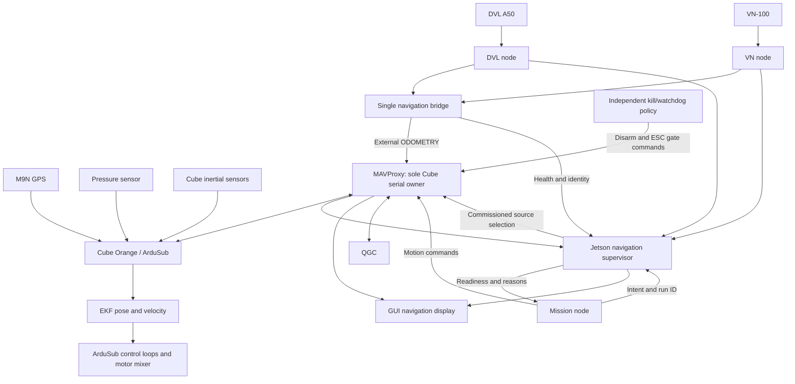

# GRAEY overnight session report — October 6–7, 2026

## Session outcome

The repository changes and documentation were saved at approximately **7:14 AM
Pacific on October 7, 2026**, in commit **76800c0**:

> Guard navigation ownership and audit GRAEY runtime pipelines

All work was performed on **tether_toggle_beichen** in the
InspirationRobotics/robotx_graey_2026 repository.

**79 Linux software tests passed. Full ArduSub SITL mission validation did not
pass.** The final simulation blocked the dive after source-change confirmation
timed out. This revision is prepared for review, not commissioned for autonomous
pool operation.

At the overnight handoff, the changes were committed locally but not pushed or
deployed. **Publication update, October 7:** at your explicit request, commit
76800c0 and its preceding local commits were pushed successfully to GitHub's
tether_toggle_beichen branch. This revised report accompanies the follow-up
documentation commit on that same branch. Main, the
Jetson's installed software, Cube parameters, and physical vehicle state were
not changed during this session. The Jetson has not been deployed or verified
against these new commits; GitHub publication does not synchronize the vehicle.

This report consolidates the overnight implementation, audit, simulations,
proposals, and remaining work into one handoff.

## What you authorized

You authorized repository work on the tether-toggle branch, bug fixes, extensive
software and simulation testing, and recording uncertainties for morning review.
You also requested proposed solutions for the broader navigation problems and a
detailed pipeline of the submarine's software.

The work therefore focused on single ownership of navigation processes, runtime
faults, simulation integrity, and architecture review. Live EKF tuning and vehicle
deployment were not performed.

## 1. Navigation ownership changes

### Problem

Core launch already starts the DVL, VN-100 and navigation bridge. The GUI could
also start copies, and prequalification launch could include another core stack.
Two bridge processes could independently integrate position and send competing
external odometry.

A bridge restart is also significant: its accumulated position starts at zero.
Automatically restarting it is not equivalent to reconnecting a network socket.

### Implemented

- Added Linux process-lifetime locks for DVL, VN-100, navigation bridge, and
  navigation supervisor.
- Locks are acquired before node construction or resource acquisition.
- A second cooperating process using the same lock directory and runtime scope
  exits before opening resources.
- Process exit, including a crash, releases the lock. The lock file is retained
  to avoid races involving different file inodes.
- Disabled navigation start/stop in both the GUI controls and backend API.
  Requests receive HTTP 409 and explain that core launch manages navigation.
- Added executable-instance counts and duplicate warnings to the GUI.
  ROS command wrappers are distinguished from actual node executables.
- Changed prequalification launch so starting another core is explicitly opt-in.
- Disabled automatic per-node respawn of the stateful navigation bridge.
- Added supervisor detection of overlapping or changed bridge identities.
  These conditions latch a frame-revalidation fault.

### Limits

These locks do not control old binaries that never acquired them. Separate
containers need a shared lock directory if they can access the same hardware.
A complete service restart still reconstructs bridge state. Deployment requires
a controlled disarmed migration and frame validation; it is not simply a hot restart.

## 2. Other bugs fixed

| Area | Change | Why it matters |
|---|---|---|
| Supervisor depth | Missing or nonfinite calibrated depth displays Unknown and cannot grant readiness | Prevents calling a surfaced vehicle underwater solely because depth is unavailable |
| MAVLink identity | LED component moved from 196 to 193; supervisor retains 196 | Removes duplicate component identity among core clients |
| VN-100 reconnect | Close failed serial handle and discard partial input | Avoids carrying broken connection state into the next connection |
| DVL reports | Validate fields, finite values, validity type and covariance before publication | Malformed measurements no longer cause partial publication or an unchecked callback failure |
| DVL covariance | Scale covariance by scale squared | Keeps covariance units consistent with scaled velocity |
| Bridge freshness | Reject negative measurement age | A backwards time comparison cannot make a measurement appear fresh |
| GUI installation | Package Leaflet JavaScript/CSS/license and parameter profiles | Installed map pages retain their dependencies |
| GUI text encoding | Correct four invalid punctuation bytes in navigation/planner HTML | Restores valid UTF-8 files and permits complete script checks |
| SITL diagnostics | Correct multi-file tail syntax | Failure reporting no longer fails while printing logs |

The supervisor's malformed bridge-status input handling was also hardened.
No numerical live EKF noise, innovation-gate, source-set or yaw-offset tuning was
applied.

## 3. SITL harness improvements

The test harness itself had weaknesses that could give misleading results.

Implemented changes:

1. Separate simulated ROS topics using domain 73 and localhost discovery.
2. Use a separate navigation ownership scope for simulation.
3. Check loopback ports before starting the stack.
4. Keep QGC forwarding disabled by default to avoid combining a real and simulated
   vehicle with the same MAVLink system ID.
5. Start the simulated EEPROM configuration fresh.
6. Archive the previous scenario result so an old success cannot masquerade as
   the result of a new failed run.
7. Stop republishing stale cached synthetic attitude as fresh sensor data.
8. Throttle unchanged waypoint retransmission instead of sending the same
   position target on every tick.
9. Retain a fixed target heading during a leg instead of following the latest
   estimated heading.
10. Abort simulated motion on lost navigation health, stale supervisor status,
    or mismatched mission run.
11. Write an explicit failed scenario result on timeout or abort.

The simulator abort disarms the simulated vehicle. It does not change the
production mission's reviewed pilot-takeover policy.

## 4. Tests and evidence

| Test | Result |
|---|---|
| Linux/WSL Python suite | 79 passed, no skips |
| Windows Python suite | 79 ran; 3 Linux-only lock tests skipped |
| Concurrent ownership | 20 contenders rejected while the original owner held the lock |
| Crash recovery | Killing the lock owner released ownership without deleting the lock file |
| Real ROS duplicate bridge in SITL | Rejected before node construction with OwnershipError |
| Running GUI navigation-start endpoint | HTTP 409, managed by core launch |
| Colcon build | Passed in all three bounded SITL runs |
| Inline browser JavaScript | All 5 script blocks passed Node syntax checks |
| Git whitespace/diff checks | Passed |
| Complete surfaced → dive → waypoint → surface scenario | **Not passed** |

The regression suite includes depth hysteresis, surface bobbing, stale sensor
and intent handling, GPS rejection/loss/recovery, configuration gates, source
acknowledgement requirements, alignment timeout, position discontinuity, and
mission interruption behavior. It also exercises 20,000 seeded state-machine
health/observation steps.

These tests establish software behavior under their modeled conditions.
They do not establish real GPS accuracy, magnetic heading accuracy, DVL mounting
correctness, or physical control performance.

## 5. What happened in the three full simulation runs

### Run 1

Navigation freshness repeatedly dropped out, so the supervisor did not qualify
the mission to dive. The run also exposed the failure-log printing bug, which
was fixed.

### Run 2

The simulated vehicle reached **0.550 m depth** and verified GPS fix loss.
It did not complete the waypoint mission before the bounded run ended.

Review of this run exposed the harness's repeated unchanged waypoint commands
and missing response to navigation-health loss. Those were corrected afterward.

### Run 3

The reported source sequence was:

**Underwater → Surface GPS → Underwater**

However, the supervisor latched:

> Source change not confirmed before timeout

The mission timed out in WAIT_DIVE_REFERENCE and wrote **passed=false**.

- Run ID: 43aa21c0-11bb-495b-858a-05343ffdcf87
- Result timestamp: October 6, 2026, approximately 11:13 PM Pacific
- This timestamp belongs to the failed simulation result, not completion of the
  entire overnight repository session.

MAVProxy recorded repeated backwards-time warnings and link outages. A separate
20-second monotonic-clock probe measured 398 intervals with no backwards jump or
interval exceeding 0.5 seconds. Therefore the root cause is **not established**.
Simulator/MAVProxy timing, delivery latency, and source-command confirmation need
further diagnosis.

No safety timeout was relaxed to obtain a pass. All simulator processes were
absent in the final process inspection. Runtime evidence remains under the
ignored sitl/logs directory. The historical October 3 success result is not
validation of this revision.

## 6. Full-system architecture conclusions

The navigation bridge is a Jetson process, not an EKF source set. It should
continue producing qualified measurements while the supervisor requests changes
to the Cube's selected aiding sources.

Important distinctions:

- GPS reaches the Cube directly. The Jetson cannot individually veto each M9N
  measurement already received by the Cube.
- The Cube performs EKF estimation and fast control.
- The bridge rotates/integrates DVL velocity using VN attitude and sends odometry.
- The supervisor checks more than depth: sensor freshness, Cube pose/EKF health,
  GPS quality, bridge identity, mission intent, source feedback, acknowledgements
  and configuration.
- The GUI projects telemetry and supervisor state; it does not independently
  improve the estimate.
- Mission code must consume supervisor readiness. Existing MissionBase supervision
  is opt-in; adding a supervisor does not automatically protect every mission.
- Navigation readiness, RF/tether watchdog selection and hardware kill remain
  separate responsibilities.

The intended source profile uses external horizontal position/velocity/yaw
underwater and GPS horizontal position with external velocity/yaw at the surface.
Historical vehicle readback differed from this intended configuration. No
commissioning claim or live parameter update was made.

## 7. Other faults and uncertainties identified

| Finding | Why it remains open |
|---|---|
| Exact DVL/VN/Cube frame agreement | Needs measured axes, rotations, timing and independent heading reference |
| Bridge whole-service restart | Locks and disabled per-node respawn do not preserve a valid frame across all restarts |
| Independent yaw during DVL loss | Current combined odometry withholding also removes external yaw |
| Pressure baseline and antenna exposure | Surface classification needs physical pressure/geometry calibration |
| Mission RC abort mapping | Default channel 8 conflicts with the code's warning about joystick-overridden channels; compare actual radio setup |
| Vision timing | Latest depth and pose are not a complete acquisition-time synchronized transform |
| Position server consistency | Older planner feed lacks the supervisor's complete health/identity checks |
| LED stale status | Cached color is not proof of current arm or physical ESC-power state |
| Kill-switch authority and recovery | Requires reviewed channel/policy truth table and physical verification |
| Standalone SITL stop script | PID-only records can be unsafe after stale PID reuse |
| Untracked Jetson helpers | Local tracked source audit does not cover unidentified deployed files |
| VN checksum handling | Parser strips the checksum rather than validating it |

These are recorded findings, not assertions that each caused the observed pool
position error.

## 8. Proposed next-step pipelines

### A. Recover a trustworthy navigation baseline

Single process ownership
→ measured sensor/body frames
→ exact firmware and parameter readback
→ selected-source and DataFlash confirmation
→ stationary and measured-motion comparison
→ justified tuning
→ repeat validation.

Do not tune GPS noise to hide a bridge reset, wrong heading transform, or origin
offset.

### B. Improve GPS and Cube accuracy

Time-align raw GPS, DVL, VN, bridge odometry and Cube estimates
→ compare against independent position/heading truth
→ separate bias, random scatter, latency and drift
→ inspect accepted/rejected observations and innovations
→ change one justified parameter at a time.

A stationary GPS cluster can be precise around the wrong point. DVL can constrain
motion but cannot establish an unknown absolute geographic offset while stationary.

### C. Reduce human error in pool mapping

Survey recognizable reference points
→ fit image scale, rotation and translation
→ validate against an unused point
→ store calibration provenance and residuals
→ display vehicle uncertainty and boundary clearance.

The supplied coordinate and screenshot remain an approximate registration.
A single point and scale require a trustworthy orientation assumption.

### D. Unify GUI navigation

Cube telemetry + sensor health + supervisor status
→ one timestamped navigation snapshot
→ navigation overview, GPS diagnostics, and pool map.

Each value should identify source, frame, age and validity reason. Raw GPS and
Cube estimate should remain distinguishable. A display-origin reset must not
reset the Cube EKF.

### E. Commission source switching

Verified pressure baseline
→ depth hysteresis/dwell
→ qualified GPS
→ fresh healthy Cube estimate
→ saved dive reference
→ external-frame alignment
→ source command
→ fresh ACK plus selected-source evidence
→ continuity check
→ mission permission.

This is the pipeline whose complete SITL validation remains unfinished.

### F. Repair and verify kill/control behavior

Authoritative radio/channel map
→ RF/tether/mission/kill truth table
→ mocked software tests
→ safe physical ESC-gate verification
→ command-versus-physical-feedback checks.

GPS recovery must never imply arming, clearing a kill inhibit, or restoring ESC power.

## 9. Corrections to earlier interpretations

- XKF4.GPS=0 is not proof that GPS fusion is disabled; it is a GPS-status field.
- Source-set parameter values describe configuration, not conclusive active-source
  selection.
- GPS fix value 4 is DGPS, not “4D.”
- The inspected partial DataFlash tail spans approximately 180.7 seconds,
  not 30 minutes.
- An incomplete header-plus-tail decode is not sufficient evidence for confident
  numerical EKF tuning.

The onboarding context and prior work-log correction were updated to preserve
these distinctions.

## 10. Repository and handoff status

- Branch: tether_toggle_beichen
- Local commit: 76800c0
- Commit description: Guard navigation ownership and audit GRAEY runtime pipelines
- Repository work saved: approximately 7:14 AM Pacific, October 7
- Push: implementation commit 76800c0 successfully published October 7 to
  origin/tether_toggle_beichen; this report is the follow-up documentation update
- Jetson deployment: not performed
- Main: unchanged
- Full SITL validation: failed/incomplete
- Numeric live EKF tuning: not performed

Detailed supporting documents created during the session:

- docs/software-pipeline-2026-10-06.md
- docs/navigation-recovery-plan-2026-10-06.md
- docs/overnight-validation-2026-10-06.md

The workspace GRAEY_CONTEXT.md was updated separately from the repository commit.
This consolidated report was created afterward at your request and revised for
the explicitly authorized GitHub publication. Only tether_toggle_beichen is
being published; no main-branch merge or vehicle deployment is part of this update.

## 11. What should happen next

1. Diagnose the SITL source-confirmation failure without weakening readiness gates.
2. Repeat a complete surfaced → dive 0.5 m → waypoint → surface mission.
3. Review the branch changes and deployment procedure.
4. Obtain complete Cube logs, exact firmware/parameters and deployed-process inventory.
5. Resolve frame/heading/pressure calibration and the radio abort-channel question.
6. Verify kill behavior before autonomous wet tests.
7. Deploy only through a controlled disarmed procedure, then verify installed
   software and live behavior separately from Git commit equality.

The overnight session produced useful fixes and a detailed review, but it did
not establish that Graey's physical position/heading accuracy is fixed.

