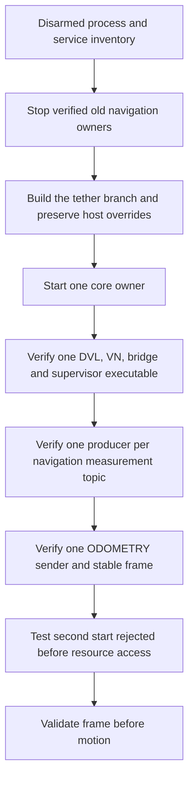
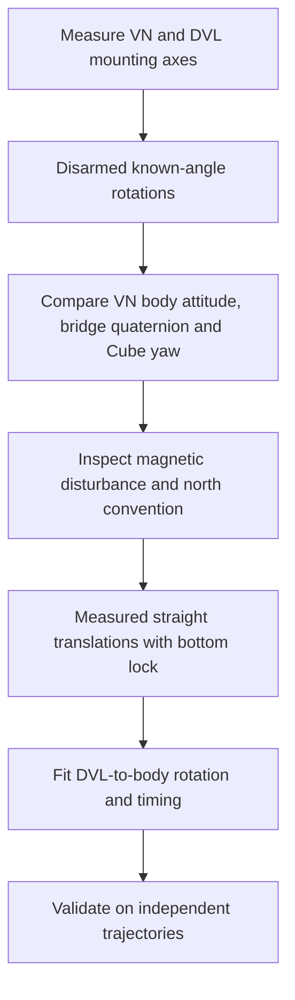
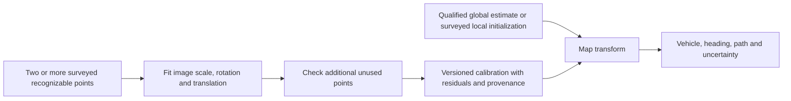
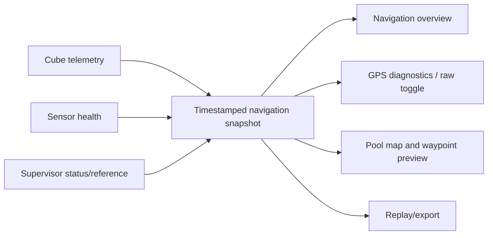
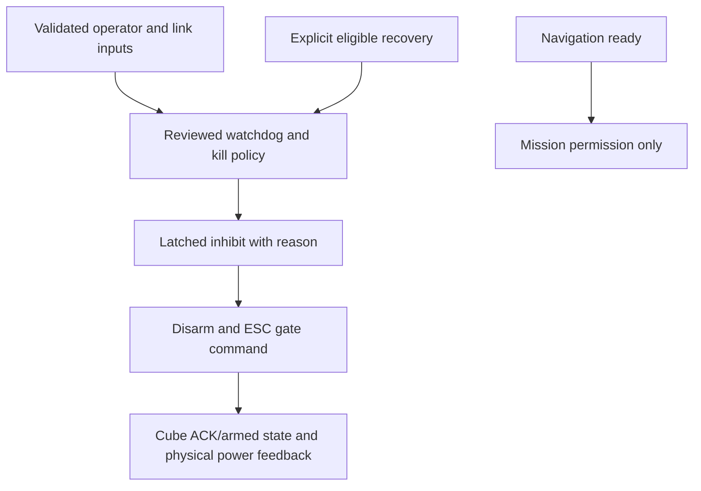
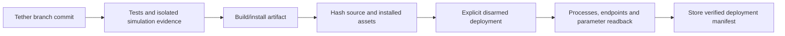

# Navigation recovery and remaining-problem pipelines — 2026-10-06

These are proposed next steps unless explicitly marked implemented. They preserve
Cube control authority and the existing MAVProxy transport architecture.
No numeric live EKF tuning or vehicle deployment was performed in this session.

## Recommended order

1. Deploy and verify single ownership while disarmed.
2. Establish measured coordinate-frame and heading correctness.
3. Verify the exact Cube firmware, parameters, selected source and fusion evidence.
4. Establish pressure baseline and reliable state classification.
5. Commission surface/underwater transitions with controlled failure tests.
6. Improve absolute position reference and pool registration.
7. Unify navigation display and planner health.
8. Validate kill/control authority before any autonomous wet test.

A smoother marker is not sufficient success. Each step needs an independent
measurement or explicit runtime evidence.

## Problem 1: competing navigation writers and frame resets

**Implemented in this branch:** pre-construction Linux locks, GUI navigation
start/stop disabled, prequal core opt-in, bridge non-respawn, duplicate/restart
identity fault, exact executable counts, distinct core MAVLink component IDs.

Deployment must account for old binaries that never acquired locks. Do not delete
lock files or restart the stateful bridge while armed to make an error disappear.
Do not start a second entire core launch merely to test duplicate navigation
protection: other control processes are outside the new navigation lock coverage.

Future recovery improvement: persist a frame-generation identity separately from
the supervisor process. Require revalidation after bridge/Cube generation changes.
A saved position alone is insufficient; an unobserved physical movement during
downtime invalidates it. Choose an explicit disarmed re-anchor procedure first.

## Problem 2: raw GPS poor, Cube position worse

Several independent errors can add together:

| Error source | Observable signature | Test |
|---|---|---|
| GPS multipath/antenna obstruction | Raw fixes jump or move while stationary | Stationary open-sky log and antenna inspection |
| Absolute GPS bias | Tight cluster away from surveyed truth | Surveyed point, not cluster scatter |
| Bridge reset/duplicates | Position steps or alternating odometry | Instance/process and packet records |
| Wrong heading/frame | DVL translation rotated in map/Cube | Measured straight translations and turns |
| Source configuration | Good raw GPS but Cube follows another source | Exact params + selected source + DataFlash evidence |
| Origin/registration offset | Consistent offset despite good relative motion | Compare origin and map reference independently |
| Time mismatch | Apparent disagreements during turns/motion | Acquisition-time aligned logs |
| DVL invalid/mis-mounted | Poor or rotated velocity despite motion | Lock/beam/velocity and mounting test |

### Measurement pipeline

```mermaid
flowchart LR
    LOG[Time-aligned raw GPS, DVL, VN, ODOMETRY and Cube log] --> ID[Verify sender identity and timestamps]
    ID --> FRAME[Verify axis signs, rotations and units]
    FRAME --> SOURCE[Verify selected aiding and innovations]
    SOURCE --> RESIDUAL[Compare each estimate to independent truth]
    RESIDUAL --> MODEL[Estimate bias, noise, latency and drift separately]
    MODEL --> TUNE[One justified parameter change in SITL/replay]
    TUNE --> REPEAT[Repeat stationary and measured-motion trials]
```

Collect a complete Cube DataFlash file from SD or a reliable transfer, exact firmware
version/hash, full parameter snapshot, ROS bag or timestamped raw sensor samples,
bridge output, source feedback and supervisor status. Record physical move/rotate
events and a measured reference. Keep arm/power-state changes out of the navigation
experiment unless deliberately required.

Stationary raw GPS averaging reduces random scatter but does not remove persistent
multipath or survey error. The historical 0.53 m RMS cluster was precision around
its own mean, not proof of half-meter absolute accuracy.

The prior DataFlash interpretation must be corrected: **XKF4.GPS=0 does not prove
GPS fusion is disabled.** It is a GPS-status field, not a binary “using GPS” switch.
Use the exact firmware's logging and status definitions. ArduPilot's
[EKF log structure](https://github.com/ArduPilot/ardupilot/blob/master/libraries/AP_NavEKF3/LogStructure.h)
labels that field as filter GPS status. Innovations alone also do not identify
every measurement actually accepted at every instant.

The inspected partial tail covered roughly 180.7 seconds using its TimeUS span,
not 30 minutes. Header+tail is an incomplete file; uncertain decode and missing
message definitions preclude confident tuning. MAVLink GPS fix value 4 is DGPS,
not “4D.”

### Practical tuning decision

Do not increase GPS noise or tighten innovation gates merely to hide a frame error.
First establish whether GPS is actually admitted to the active lane/source and
whether ExternalNav is internally consistent. Then compare normalized innovation
behavior, rejection frequency and actual position error under known motion.

Suggested acceptance criteria should be chosen from pool clearance and mission
needs, not invented from a screenshot. Record maximum step at transition, stationary
drift, straight-line endpoint error, heading error and recovery delay. A test can
pass continuity while still failing absolute accuracy.

## Problem 3: heading accuracy and automatic initialization

A single stationary M9N position does not identify which direction the submarine
faces. DVL speed near zero cannot identify yaw either. Software cannot recover a
missing absolute heading reference simply by averaging those values longer.

Propose one explicit sensor-to-body rotation representation instead of scattered
yaw offsets. Verify all three axes: upside-down correction must transform angular
rates and acceleration consistently with orientation. Do not infer correctness
from only a yaw reading on level ground.

If accurate heading without operator alignment is essential, evaluate a measured
external reference (surveyed visual marker or compatible heading hardware). GPS
course can help during a sufficiently long known translation, but sideways motion,
currents, low speed and small pool dimensions make it different from body heading.
Hardware selection remains a separate research/requirements decision.

## Problem 4: pool registration with minimal human error

Keep three independent objects:

1. The measured pool geometry.
2. The image-to-local-map transform.
3. The vehicle-to-local-map estimate with uncertainty.

The supplied clicked geographic point anchors an approximate image. Its five
decimal places alone correspond to roughly meter-level coordinate increments
here, before image/georeferencing error. The 5 m distance determines scale; it
cannot determine translation and rotation alone.

Best pool workflow: measure a local coordinate system with tape/laser and recognizable
control points, survey geographic coordinates only if global accuracy is required,
and use an additional point to check the fit. Retain raw image pixels and physical
coordinates so cropping/resizing cannot silently change scale.

Display the uncertainty region and distance to the nearest pool edge. Do not
automatically shift the map to make the vehicle icon look plausible. If uncertainty
is comparable to wall clearance, the display must say the position is unsuitable
for waypoint execution. Simulation can render a path even while real localization
is unqualified; label SIM prominently.

## Problem 5: improve GUI organization and a common navigation snapshot

Propose a single read-only navigation data contract consumed by both main navigation,
GPS detail and pool planner.

Every value should carry source, sample age, validity reason and reference frame.
The overview should show Cube pose, mission-relative position, geographic position,
heading source, depth, supervisor state, selected source, and readiness reason.
GPS details should show raw receiver output separately from estimated position.
A raw-data toggle must not change the estimate used by mission control.

Pool map should use the same selected estimate and mission reference. Include
fit-to-pool, vehicle-visible indicator, marked dive reference, track reset and
reference quality. If the marker is outside the image, show bearing/distance and
offer “fit vehicle + pool”; do not clamp it to the water.

Planner clicks first become a preview in a clearly named frame. Only a separate
explicit action should authorize a mission. The planner must reject stale pose,
wrong runtime, invalid registration or a reference from an old run.

The existing GUI is not fully migrated to this contract in this session. Its
ownership controls and packaged assets are fixed; the larger redesign is a proposal.

## Problem 6: surface bobbing, GPS rejection and depth baseline

The current hysteresis/dwell structure is appropriate to test, but thresholds need
physical depth-sensor and antenna-height calibration. “Surface” for antenna exposure
is not necessarily zero pressure at the Bar30.

Proposed commissioning:

1. Record pressure while the antenna is clearly out of water at known sensor depth.
2. Verify sign, density and pressure-message identity.
3. Measure pressure-to-antenna geometry and practical bobbing range.
4. Select thresholds around sustained antenna exposure, with separated enter/exit.
5. Replay recorded bobbing depth with GPS dropout/rejection patterns.
6. Validate source feedback and continuity while disarmed before dynamic testing.

Never auto-calibrate surface pressure simply because speed is zero: the sub may be
stationary underwater. Require an explicit physical surface assertion or a separately
validated measurement. Store baseline time, value and provenance.

Consider separating independent heading transport from DVL position/velocity so
loss of bottom lock need not remove valid yaw. That change needs exact firmware
support and failure tests; blindly sending stale position with fresh attitude is
not acceptable.

## Problem 7: kill switch and command authority

Prepare a truth table covering armed/disarmed, RF/tether selected, RF fresh/stale,
tether healthy/lost, SA kill state, mission active, Cube mode, startup inhibit,
source-change inhibit, and explicit recovery.

Resolve RC abort channel 8 versus the documented joystick conflict and actual
SA channel mapping. Confirm only one joystick/control sender is active. Verify
neutral command handling before arming. A watchdog source toggle does not necessarily
disable all commands from the other input.

Test software logic with a mocked Cube first, then bench-test the physical chain
with propulsion made safe. Record commanded versus measured contactor/ESC state.
Decide the autonomous connection-loss policy explicitly with the team; no unreviewed
policy change was made here.

## Problem 8: reproducible repo/deployment synchronization

Use a manifest containing Git commit, branch, dirty tracked files, installed package
hashes, service overrides, parameter snapshot and firmware version. “Git HEAD matches”
does not prove installed Python/assets or parameters match.

Main remains separate until a reviewed merge is requested. Vehicle-only overrides
must be preserved and documented, not overwritten by a Git reset. Untracked helpers
must be inventoried before a “fully synchronized” claim.

## Morning questions and unresolved decisions

- What measured position/heading accuracy and wall clearance are required?
- Can we obtain a complete Cube log and exact firmware build?
- Is there an independently surveyed pool point and heading baseline?
- Which mission entry point will be the production supervised mission?
- What is the authoritative radio channel map and desired autonomy/link-loss policy?
- Should loss of bottom lock retain independently validated VN yaw?
- Which services or untracked helpers exist on the Jetson beyond this tracked repo?
- What disarmed bridge restart/re-anchor procedure should become the standard?

These do not block the repository ownership fixes. They do block claiming accurate
absolute navigation or commissioning autonomous pool motion.

