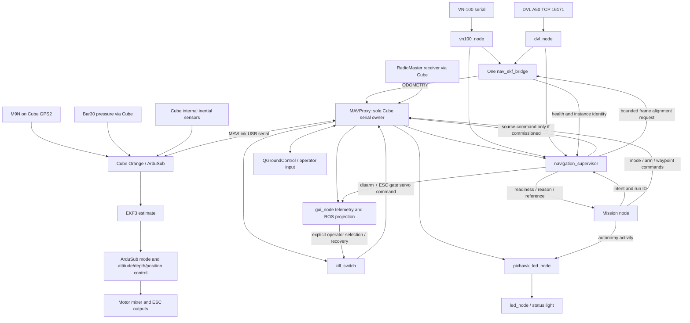
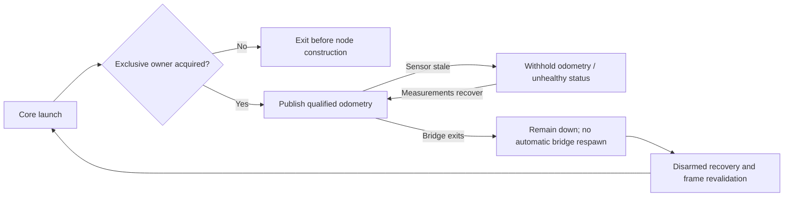
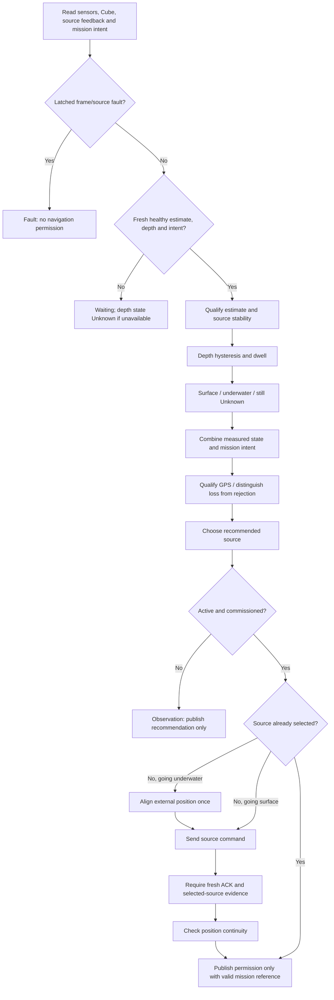
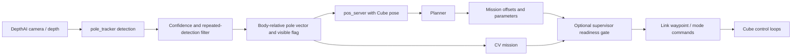
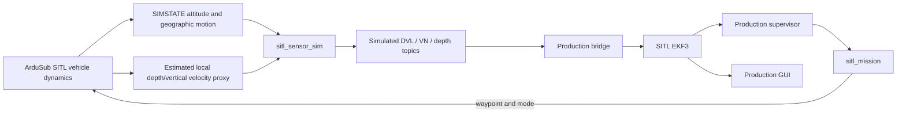

# GRAEY software pipeline and runtime audit — 2026-10-06

## Scope and evidence

This describes the tracked code on `tether_toggle_beichen`, inspected from baseline
`1e09b32` and the changes in this work session. It is not a claim that the Jetson,
Cube, wiring, or GitHub are currently identical. No vehicle connection, deployment,
arming, parameter write, main-branch change, or hardware test was performed here.
The latest historical vehicle observations are dated October 4.

Read this alongside `navigation-recovery-plan-2026-10-06.md` and
`overnight-validation-2026-10-06.md`. Source paths below are relative to this repo.
The package root is `robotx_graey_2026/api/`.

**The navigation bridge and an EKF source set are different things.** The bridge
is a running Jetson process producing external odometry. A source set is Cube
configuration choosing which measurements EKF3 uses. Switching source sets does
not require starting or stopping the bridge. There should be one bridge per
vehicle runtime, continuously producing qualified measurements.

## 1. System-wide data and command pipeline

Arrows describe software interfaces, not proof of current physical wiring.
GPS enters the Cube directly; it does not first pass through the Jetson supervisor.
The supervisor can select a configured EKF source set. It cannot individually
discard M9N measurements already delivered to the Cube.

The Cube retains the fast control loop and EKF. The Jetson bridge performs
dead reckoning and measurement transport, the supervisor arbitrates readiness
and source selection, and mission code requests motion. The GUI displays these
layers and has explicit operator control endpoints. It is not an estimator.

## 2. Startup, process ownership, and restart behavior

1. Host systemd starts `graey-mavproxy.service`.
2. MAVProxy opens the Cube's stable USB by-id path at 115200 baud.
3. `graey-ros.service` executes ROS Humble core launch inside the `graey` container.
4. Core starts status LED output, Pixhawk LED logic, kill switch, DVL, VN-100,
   navigation bridge, navigation supervisor, and GUI.
5. Each MAVLink client connects to its own MAVProxy UDP endpoint and registers by heartbeat.
6. Sensor nodes publish measurements. The bridge waits for qualified DVL and VN data.
7. The supervisor evaluates observations but core defaults it to Observation.
8. The operator separately starts optional perception/planner/mission components.

New ownership rules in this branch:

- DVL, VN-100, bridge, and supervisor acquire an OS process-lifetime lock before
  constructing the ROS node or opening its hardware/socket resources.
- A second cooperating executable in the same scope exits before acquiring resources.
- Process exit, including SIGKILL, releases the lock. Lock files are not deleted,
  preventing split-lock inode races.
- GUI navigation start and stop return HTTP 409. The navigation row shows
  “Managed by core launch” and actual executable counts.
- Wrapper processes such as `ros2 run` are excluded from those counts.
- Prequal launch defaults `start_core:=false`. Standalone startup requires explicitly
  selecting true after stopping the existing core service.
- The stateful bridge no longer automatically respawns inside core launch.
  Its accumulated position starts at zero after construction; blind restart is unsafe.
- Other core nodes retain the existing respawn policy.

Limits: existing old-code processes do not acquire these locks; deployment requires a
controlled disarmed shutdown and process inventory. Containers must share the lock
directory if they can access the same hardware. Changing `GRAEY_RUNTIME_SCOPE`
is not hardware isolation. A whole core/service restart still reconstructs the bridge.
A supervisor restart loses its in-memory fault history, so these changes are not
a complete persistent frame-recovery system.

## 3. Network and MAVLink ownership

| Consumer | MAVProxy UDP endpoint | Component ID in this branch | Role |
|---|---:|---:|---|
| Navigation bridge | 14551 | 197 | External ODOMETRY |
| Pixhawk LED node | 14552 | 193 | Armed/mode status |
| Real mission base | 14553 | 198 by default | Mission commands and telemetry |
| Position server | 14554 | 191 | Planner pose feed |
| GUI | 14555 | 195 | Telemetry and operator endpoints |
| Kill switch | 14556 | 194 | Connection watchdog / ESC gating |
| Navigation supervisor | 14557 | 196 | Source selection/readiness |
| SITL sensor simulator | 14558 | 201 | Synthetic sensor feed |
| SITL mission | 14559 | 198 | Isolated demonstration mission |

The LED node previously reused supervisor component 196; this branch assigns 193
and tests uniqueness for the concurrently running core clients. Mission variants
still must not run concurrently simply because they are different executables.

Live `scripts/start_mavproxy.sh` exposes 14551–14556 on all interfaces and 14557
on loopback. QGC output is 14570, directed to an explicit laptop IP or broadcast.
Historical tether forwarding used 192.168.2.1. Current host overrides require live
inspection; repository service files are not proof of deployed overrides.

`api/pixhawk/mavlink.py` implements shared transport behavior, not a single
central ROS bridge. Each node has its own Link/socket. Link rate-limits socket
reopening after errors, preserving the bridge's accumulated state across a network
reconnect. A new socket source port must register with MAVProxy again.

## 4. Sensor acquisition and external odometry

### DVL A50

`navigation/dvl_node.py` connects to 192.168.2.10:16171 and parses newline-delimited
JSON. It publishes:

| Topic | Type | Meaning |
|---|---|---|
| `/graey/dvl/velocity` | TwistWithCovarianceStamped | Velocity and covariance |
| `/graey/dvl/valid` | Bool | DVL validity/bottom-lock result |
| `/graey/dvl/altitude` | Float32 | Distance above bottom |
| `/graey/dvl/sample` | JSON String | Atomic timestamp, velocity, validity, sensor time |

The atomic sample prevents the bridge from combining a new velocity with an old
validity message. Missing bottom lock is **not** measured zero velocity.

New validation rejects malformed/nonfinite measurements before partial publication,
checks boolean validity and covariance shape, and scales covariance by scale squared.
Malformed velocity reports emit invalid status and an invalid atomic sample.
Default scale remains 1.0; no physical scale calibration changed.

Remaining limits: connection attempts can block the node executor for up to five
seconds. Freshness checks in other processes must handle that. JSON line buffering
is not bounded. Full covariance positive-semidefinite validation is absent.

### VN-100

`navigation/vn100_node.py` reads a stable FTDI by-id serial device at 115200 baud,
parses VNYBA yaw/pitch/roll, acceleration and angular rates, and publishes:

- `/graey/vn100/imu`: attitude quaternion, angular velocity, acceleration.
- `/graey/vn100/heading`: heading in degrees.

The code has an upside-down mounting correction and optional yaw offset.
The physical mounting transform, magnetic calibration, and true-versus-magnetic
north convention still need measured verification. A GUI heading that agrees with
another derived output is not independent heading truth.

New reconnect cleanup closes the failed serial handle and discards a partial line.
The parser currently strips rather than validates the incoming checksum. That is
an identified integrity gap, not fixed by reconnect cleanup.

### Bridge

`navigation/nav_ekf_bridge.py` subscribes to VN IMU and the atomic DVL sample.

1. Require advancing sample timestamps.
2. Reject nonfinite quaternions/rates and grossly invalid quaternion norm.
3. Reject invalid/nonfinite DVL velocity and repeated DVL sensor timestamps.
4. Require both streams fresher than 0.5 s.
5. Rotate body velocity into the bridge world frame.
6. Integrate position for positive sample intervals below 0.5 s.
7. Send ODOMETRY at 20 Hz with position, quaternion, body velocity, angular rates,
   and reset counter.
8. Publish bridge health and a unique process instance at 5 Hz.

The bridge sends LOCAL_FRD position and BODY_FRD velocity. It currently sends
unknown covariance through Link. Position and velocity originate from the same
DVL measurements and are correlated; treating them as independent high-confidence
truth would be wrong.

Loss of DVL also suppresses external yaw because these are bundled into one
ODOMETRY message. An independently valid VN heading channel is a proposal requiring
firmware/transport testing, not an already implemented fallback.

Alignment is disabled by default. When explicitly enabled, a short-lived supervisor
request copies the healthy Cube local position once into bridge position and bumps
the reset counter. This is transition alignment, not continuous Cube-to-bridge
feedback. It assumes orientation/frame compatibility already exists.

## 5. Cube EKF and source configuration

The intended, code-verified profile is:

| Quantity | Underwater | Surface GPS |
|---|---|---|
| Horizontal position | ExternalNav (6) | GPS (3) |
| Horizontal velocity | ExternalNav (6) | ExternalNav (6) |
| Vertical position | Baro/pressure path (1) | Baro/pressure path (1) |
| Vertical velocity source selection | None (0) | None (0) |
| Yaw | ExternalNav (6) | ExternalNav (6) |
| SRC_OPTIONS | 0 | 0 |

“None” for an aiding source does not turn off inertial propagation. VN data supplied
as external attitude/odometry is also not the same as replacing the Cube's internal
inertial sensors.

Historical readback differs: SRC1 horizontal position/velocity/yaw were ExternalNav,
SRC2 horizontal sources/yaw were disabled, and SRC_OPTIONS was 1. The deployed
supervisor was not commissioned for switching. Do not load the intended profile
merely because it appears in this table.

ArduPilot supports source-set selection by MAVLink command. Its source-options
velocity-fusion bit can combine configured velocity sources and requires consistent
frames. See [ArduSub source selection](https://ardupilot.org/sub/docs/common-ekf-sources.html).
Current documentation may describe features newer than the vehicle firmware.

ArduPilot documents external ODOMETRY fields, reset handling, and update requirements.
Its current setup example uses VISO_TYPE=3, while historical Graey readback/profile
uses 1. Resolve that against the exact installed firmware before changing it:
[External navigation documentation](https://ardupilot.org/dev/docs/mavlink-nongps-position-estimation.html).

DVL can constrain velocity and the EKF can reject inconsistent observations.
Neither proves geographic position is correct. A biased position origin, wrong yaw
rotation, faulty external position frame, or incorrect fusion configuration can
produce a stable but wrong estimate.

## 6. Exactly what the navigation supervisor reads

`navigation/navigation_supervisor.py` consumes independent ROS sensor messages plus
Cube MAVLink. It is not merely observing depth.

| Input | Check / use |
|---|---|
| Cube HEARTBEAT | Connection freshness |
| LOCAL_POSITION_NED | Fresh, finite pose; boot-time reset detection |
| GPS_GLOBAL_ORIGIN | Origin changes invalidate mission frame |
| EKF_STATUS_REPORT | Required validity flags; rejects constant-position/uninitialized states; variance checks |
| GPS_RAW_INT | Advancing receiver timestamp, fix, hAcc, coordinates |
| SCALED_PRESSURE2 by default | Calibrated pressure-derived depth |
| NAV_SRC named value | Actual selected source report, separately from command ACK |
| COMMAND_ACK for 42007 | Accepted/rejected source command |
| PARAM_VALUE | Intended source profile readback |
| DVL validity and velocity | Fresh, finite sensor health |
| DVL atomic sample | GPS-versus-motion consistency history |
| VN IMU | Advancing timestamp and quaternion norm |
| Bridge status | Healthy publisher, instance changes/overlap |
| Mission intent | SURFACE/DIVE/UNDERWATER, run ID, increasing sequence |
| Saved mission reference | Historical record; current epoch/run must match |

Depth is computed from pressure relative to a configured surface baseline:
`depth = (pressure_hPa - baseline_hPa) * 100 / (density * 9.80665)`.
Default baseline zero makes depth unavailable. It must not imply underwater.

The supervisor runs at 10 Hz. Cube link allows 3 s age, EKF status 2 s,
pose/DVL/VN/bridge approximately 0.5 s, and mission intent approximately 1 s.
Source and ACK freshness are independently tracked.

GPS screening checks quality and compares motion over a time window with DVL travel.
It can reject an implausible jump but cannot detect every slowly changing common
bias or prove the initial latitude/longitude correct. Reported hAcc is an estimate,
not a guarantee.

## 7. Supervisor state and transition pipeline

- Surface qualification: depth at or below 0.15 m for 2 s.
- Underwater qualification: depth at or above 0.4 m for 2 s.
- Between thresholds: retain the previously qualified classification.
- Missing/nonfinite depth: display Unknown, withhold navigation readiness.
- GPS must remain qualified for 3 s before admission.
- A brief missing-GPS interval can retain the surface source for up to 3 s.
- Explicitly rejected GPS bypasses that grace period.
- DIVE/UNDERWATER intent or measured submergence requests underwater aiding.
- A requested dive first needs a qualified new GPS fix and healthy Cube position.
- Save that paired reference, align the external position, select Underwater,
  and wait for acknowledgement plus source feedback.
- Source-change/alignment timeout or rejection latches a fault.
- Duplicate/changed bridge identity latches a frame-revalidation fault.
- GPS recovery never arms, clears a kill fault, or restores ESC power.

The grace period does not manufacture GPS measurements. The Cube's own EKF performs
propagation and measurement admission while that source set is selected.
Readiness loss does not itself command thrusters: mission integration must consume it.

## 8. The four references that must stay distinct

| Reference | Purpose | Reset semantics |
|---|---|---|
| Cube EKF origin | Geographic anchor for Cube local coordinates | Keep continuous during mission |
| Bridge accumulated position | External dead-reckoned frame | Stateful; restart requires revalidation |
| Jetson mission reference | GPS + Cube position paired at dive start | New per mission/run and vehicle epoch |
| GUI display origin / pool image transform | Display coordinates and image registration | Display-only actions must not change EKF |

Mission coordinates subtract the saved Cube reference from current Cube local pose.
They do not reset the Cube EKF. The map marks the saved GPS dive-start reference.
A historical reference loaded from disk is not automatically current after reboot.

The pool screenshot registration uses user-supplied 32.92357,-117.03855 at a green
point, image pixel 924,850 in the calibrated image, approximately 3.048 m/150 px,
and assumed north-up orientation. It is approximate image registration, not survey.
Another screenshot zoom requires a new pixel transform; pixel locations cannot be
copied between screenshots.

## 9. GUI and planning data paths

`gui/gui_node.py` listens on 8090. It combines MAVLink telemetry with ROS sensor
and supervisor status. The browser does not directly talk to the Cube.

- Raw GPS: GPS_RAW_INT, including quality and timestamp.
- Cube geographic estimate: GLOBAL_POSITION_INT, gated by EKF position health.
- Cube local position: LOCAL_POSITION_NED.
- Attitude: ATTITUDE; VN heading is separately available.
- Source/state/reasons/mission reference: supervisor JSON.
- Sensor health: DVL/VN and other ROS inputs.
- Pool map: image transform plus qualified GPS/Cube positions.
- Navigation display reset: display session/trail origin; not flight-controller reset.
- System controls: GUI endpoints invoke separate node/service/operator actions.

QGC obtains its own MAVLink feed. Changing a GUI marker or pool image registration
does not move QGC's Cube estimate. Two system-ID-1 feeds (real and SITL) can make QGC
alternate positions; the local runner disables QGC forwarding by default.

`navigation/pos_server.py` serves 8081/pos for the older planner and subscribes to
pole detections. It is a second pose-consumer path, not the EKF source selector.
Its freshness fixes do not establish complete equivalence to GUI health gates.
Unifying these consumers is proposed in the companion recovery plan.

Street-view vendor assets are now included in non-symlink installs as well as
HTML/PNG assets. This fixes a packaging omission, not satellite-image accuracy.

## 10. Perception and mission pipeline

MissionBase's state sequence:
WAIT_RC (optional), WAIT_NAV, ARM, DIVE, TO_GATE, TO_MARKER, MANEUVER,
RETURN_GATE, RETURN_HOME, SURFACE, DONE.

Default dry_run is true. Real missions must explicitly select non-dry operation.
The older mission frame uses forward/right offsets rotated by captured start heading.
That is distinct from a globally north-aligned mission reference and needs clear UI labels.

Navigation supervision is opt-in in MissionBase. With it enabled, live operation
requires the explicit pilot_takeover abort policy. Lost readiness latches interruption,
requests MANUAL, and does not automatically resume. With supervision disabled,
the older path does not gain these guarantees.

Observed gaps requiring follow-up:
- The mission abort channel default is 8 although its own comment says channels
  must be above 8 to avoid joystick override; kill_switch uses a different SA mapping.
  Resolve actual radio mapping before changing either.
- Vision uses latest depth/pose rather than a complete acquisition-time synchronized
  transform pipeline. A fresh publication can hide old perception data.
- Camera-thread failure may leave the ROS process alive.
- Position server lacks the supervisor's full EKF/identity validation.
- The shared Link drain loop is unbounded; sustained traffic can starve timers.

## 11. Kill switch, connection policy, and LEDs

These remain separate from navigation health.

`pixhawk/kill_switch.py` starts inhibited. It monitors Cube/RC freshness,
RF heartbeat edges, selected watchdog source, operator switches, and mission/mode
conditions. Tether watchdog default is 192.168.2.1 on enP8p1s0.

Selecting tether is a disarmed, interlocked action and intentionally produces
SOURCE_CHANGED inhibit. Recovery is another explicit action with health checks.
An RF switch can still matter while tether is selected; selection chooses the
watchdog policy, not necessarily exclusive pilot command ownership.

Software inhibit sends disarm and commands the ESC gate servo. The documented
hardware chain continues through Pololu/SSR/contactor; this audit does not verify
that wiring or measure contactor state. Commanded ESC state is not physical feedback.

The existing autonomous-mode connection-loss exception is a policy decision.
Changing it casually could either remove an intended mission capability or leave
an unattended vehicle moving. Preserve it pending a reviewed truth table.

Pixhawk LED logic maps disarmed to red, armed manual control to yellow, and armed
autonomy to green. It is not a navigation-health light. It currently caches armed/mode
without a full stale-telemetry override; therefore color alone is not sufficient
evidence of live arm state or physical ESC power.

## 12. SITL loop and its limits

The feedback loop is software vehicle dynamics → synthetic sensors → production
bridge/EKF/supervisor → mission commands → dynamics. Synthetic horizontal motion
uses finite differences of SIMSTATE geographic position. Vertical input uses Cube
local-state proxy, so this is not independent sensor truth or a complete physical
sensor-error model. It cannot validate real compass interference, DVL mounting,
pressure calibration, multipath, or absolute pool accuracy.

The runner uses ROS domain 73, localhost discovery, a separate ownership scope,
loopback MAVLink ports, occupied-port preflight, fresh simulator EEPROM defaults,
and disabled QGC output unless deliberately opted in. Directly launching the
SITL launch file outside the runner does not automatically provide all isolation.

This session adds stale synthetic-input rejection, waypoint resend throttling,
fixed target heading during a leg, explicit failure result recording, and an
abort for lost navigation health during the simulated movement stages.
The simulated abort disarms; it is not a replacement for the reviewed live abort policy.

## 13. Audit conclusions and priority

| Priority | Finding | Status |
|---|---|---|
| High | Multiple stateful bridge/sensor starts possible | Locking + GUI/prequal ownership fixed; deployment pending |
| High | Bridge automatic respawn resets external position | Disabled per-node respawn; whole-stack recovery still open |
| High | Historical source configuration differs from intended profile | No blind live changes; commissioning required |
| High | Source feedback/depth baseline missing historically | Explicit Unknown; live validation pending |
| High | SITL continued commands after health loss | Harness now fails and records result |
| High | Actual DVL/VN/Cube frame agreement unproved | Measurement plan prepared |
| High | RC abort channel/comment mismatch | Record and resolve against radio configuration |
| Medium | LED and supervisor shared component 196 | LED moved to 193; uniqueness regression |
| Medium | Non-symlink map assets missing | Vendor packaging fixed |
| Medium | VN serial handle and partial data on reconnect | Cleanup fixed and tested |
| Medium | Malformed DVL fields could crash publisher | Validation and invalid publication added |
| Medium | Synthetic cached sensor data looked fresh | Freshness gate added |
| Medium | Negative measurement age accepted by bridge | Rejected and regression-tested |
| Medium | Old SITL success file survived a failed run | Prior result archived before new run |
| Medium | Vision timestamp and pose synchronization gaps | Proposed, not silently rewritten |
| Medium | LED cached status can outlive telemetry | Needs explicit Unknown/offline design |
| Medium | Incomplete ownership across containers/legacy nodes | Controlled migration required |
| Medium | PID-only SITL stop script risks stale PID reuse | Use owned run cleanup; standalone stop redesign remains open |

This is a source/runtime audit of the tracked project, not a certification of every
dependency, deployed file, firmware path, or hardware interlock. Untracked Jetson
helpers and any sonar/other services must be inventoried on the vehicle later.

